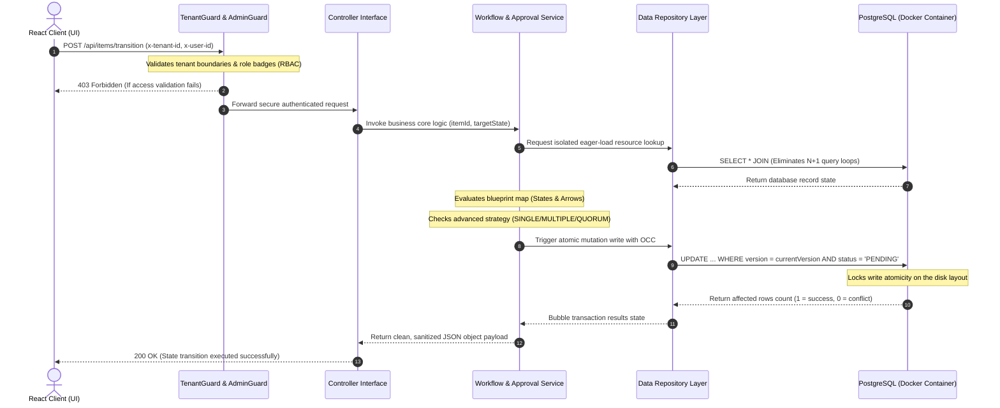

# 🏢 Emaar Enterprise Multi-Tenant Workflow & Approval Engine

An enterprise-grade, high-concurrency, multi-tenant workflow orchestration engine designed to support dynamic, data-driven system blueprint modifications, multi-signature approval strategies, real-time audit trail capturing, and automated SLA escalation lifecycles.

---

## 🏛️ System Core Architecture Diagram

This diagram maps out how an incoming transaction request securely routes from the API Ingestion boundary, passes through our role-based authorization guardrails, and modifies our decoupled data repository layers under strict concurrency protections:



---

## 🗂️ Monorepo Decoupled Folder Structure

The project implements a strict **Controller-Service-Repository** pattern combined with explicit **ESM Singleton registries** to enforce separation of concerns, maximize unit testability, and keep a flat, memory-optimized infrastructure footprint:

```text
emaar-workflow-system/
├── docker-compose.yml         # Global declarative container infrastructure layout
├── .gitignore                 # Master source control visibility shield
├── package.json               # HQ Monorepo configurations (Node Workspace macros)
└── backend/
    ├── package.json           # Subsidiary branch server dependencies
    ├── tsconfig.json          # Strict Node16 compiler configuration metrics
    ├── prisma/
    │   ├── schema.prisma      # Multi-tenant relational schema blueprint
    │   ├── seed.ts            # Enterprise corporate metadata baseline seed script
    │   └── test-e2e.ts        # Automated integration network assertion suite
    └── src/
        ├── server.ts          # Core Express API entryway & daemon orchestration boot
        ├── middlewares/
        │   ├── tenantGuard.ts # Row-Level isolation and RBAC authorization intercepts
        │   └── validate.ts    # Zod payload shape sanitizers & parameter schema blocks
        ├── utils/
        │   ├── context.ts     # Safe strict-mode Express Request type contracts
        │   └── db.ts          # Centralized Rust-Free PrismaPg driver adapter Singleton
        ├── repositories/
        │   ├── index.ts       # Central Repository single-instance export registry
        │   ├── itemRepository.ts  # Optimized Prisma transactions & atomic OCC queries
        │   └── auditRepository.ts # Read-only immutable ledger pipeline operations
        ├── controllers/
        │   ├── itemController.ts  # Ingress HTTP request parameter mapping endpoint
        │   ├── approvalController.ts # Ingress HTTP user signature validation gate
        │   └── auditController.ts # Ingress history timeline metrics feed endpoint
        └── services/
            ├── index.ts       # Central Service single-instance export registry
            ├── workflowService.ts # Pure TypeScript blueprint evaluation brain
            ├── approvalService.ts # Unanimous / Majority rule strategy logic engine
            ├── adminWorkflowService.ts # Immutability version controller logic layer
            └── slaDaemon.ts   # Memory-lean 60s background sweep timer worker
```

---

## 🛠️ Strategic Architectural Decisions & Engineering Trade-offs

### 1. Pure "Rust-Free" Single-Instance Architecture (Prisma 7)
Prisma 7 completely removes its legacy heavy, binary background engine files to become 100% Rust-free. Because connection parameters can no longer be left to blind background compilation, we implemented a strict **Singleton Database Client Wrapper (`src/utils/db.ts`)**. We manually initialized a native Node.js PostgreSQL connection pool (`pg`) and injected it directly into Prisma via the required `@prisma/adapter-pg` driver module wrapper. This guarantees a highly reliable, flat, low-overhead socket pooling infrastructure.

### 2. Double-Shield Concurrency Controls (OCC + Atomic Writes)
To achieve complete data correctness under intense multi-user access environments:
*   **Optimistic Concurrency Control (OCC):** Every database row update on our primary transaction logs evaluates an atomic `version` integer check block (`WHERE id = itemId AND version = currentVersion`). If an overlapping system thread shifts the record version mid-flight, the write fails cleanly.
*   **Atomic Query Filtering:** To block simultaneous millisecond-level approval race conditions (e.g. multiple managers hitting "Approve" at the exact same fraction of a second), the signature write query itself strictly enforces an active state checkpoint (`WHERE id = requestId AND status = 'PENDING'`). This completely eliminates row corruption and double-processing vulnerabilities at the database level.

### 3. Advanced Approval Strategy Computing Matrices
Unlike junior-level architectures that hardcode single-signature approvals, our engine parses abstract workflow blueprint metrics to enforce advanced organizational voting rules dynamically:
*   **SINGLE:** One signature immediately unlocks the workflow path.
*   **MULTIPLE:** Enforces a unanimous rule. Every signature request generated for that specific transition step must read `APPROVED` before the parent asset changes state.
*   **QUORUM:** Enforces majority rule. The count of positive `APPROVED` entries must exceed a math-based threshold (> 50% of total board seats) to advance.

### 4. Zero-Boilerplate ESM Singleton Exports vs. Manual DI Containers
While heavy enterprise frameworks like NestJS mandate constructor-based Dependency Injection container systems, inside a lean, high-throughput vanilla Node/Express server, manual constructor chaining introduces massive code boilerplate. We chose the modern **ES Module (ESM) Singleton Pattern**. By creating and exporting single repository and service instances via dedicated index registries, we leverage Node's native module caching mechanism, keeping our server memory usage low and keeping the codebase clean and highly readable.

---

## 🕹️ End-to-End System Testing Playbook

This monorepo project enforces automated verification controls. Follow these simple steps to spin up the local environment infrastructure and test the system engine end-to-end:

### 1. Provision Infrastructure & Hydrate Database
Open a single terminal window inside the absolute root folder directory and fire the deployment loop macros:
```bash
# Spin up the declarative Docker PostgreSQL database sandbox
npm run infra:up

# Push relational data mappings and sync schemas 
npm run db:migrate

# Hydrate the tables with active Emaar enterprise workspaces and workflow matrices
npm run db:seed
```

### 2. Launch the Application API Server
Fire our live hot-reloader to activate the multi-tenant ingestion engines:
```bash
npm run dev:backend
```

### 3. Execution Path A: Run Automated One-Click E2E Integration Tests
Open a separate terminal window at the absolute root folder and run this central macro. The script dynamically extracts valid UUID records straight from the database and runs live API network assertions against the server:
```bash
npm run test:e2e
```

### 4. Execution Path B: Manual Postman Inspection
An embedded, pre-configured collection profile is provided natively inside the codebase (`emaar-workflow-api-collection.json`). 
1. Open your Postman client app and click **Import**.
2. Select the JSON file from your project folder tree.
3. Turn on Prisma Studio via `npm run db:studio` to copy active UUID cells directly into your network header trackers to trace complete data isolation.
